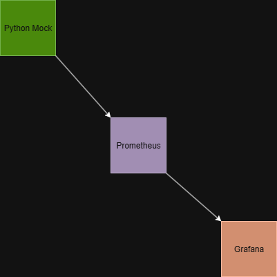

# Monitoring Hub

## Overview
A lightweight monitoring stack with **Prometheus**, **Grafana**, and a custom **Python exporter** that generates mock metrics (CPU, Disk, Uptime, Service Health).  

This project demonstrates how to build a full monitoring pipeline from scratch, provision dashboards automatically, and version-control the entire setup.

---

## Architecture


---

## Components
- **Prometheus** → scrapes metrics from exporters.  
- **Python Exporter** → mock `/metrics` endpoint using Flask + prometheus_client.  
- **Grafana** → dashboards for visualization (auto-provisioned).  

---

## Quickstart

1. Clone repo:
   ```bash
   git clone git@github.com:itrex24/Monitoring-Hub.git
   cd Monitoring-Hub
